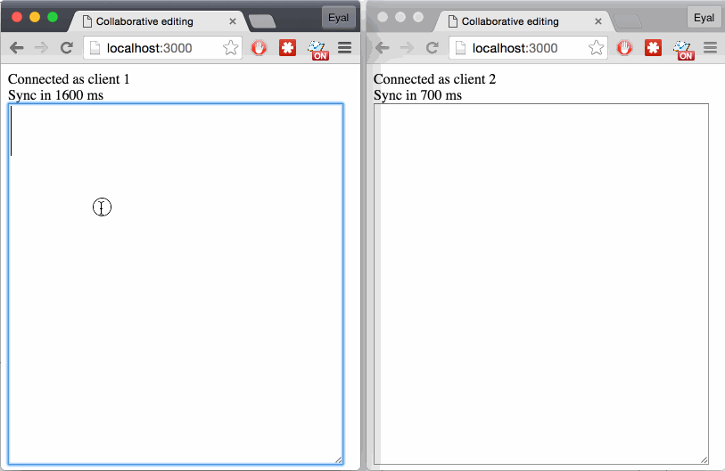

# olio

Synchronized collaborative state editing.  

Use as:

0. A client which syncs with a server.
0. A server which syncs with multiple clients.
0. A client which syncs directly with other clients in a peer-to-peer network.

Transport layer and synchronization timing are up to you. Use HTTP, Websockets,
WebRTC data channel, or whatever.

Peers generate sync requests and sync responses (a sync cycle). A sync request
contains changes to state made by peer A which peer B should apply. The response
from peer B contains changes since peer's A last sync.

```js
// A state is any generic data structure.
// State objects are synchronized between peers.
var myState = new State();

// Sync objects wrap a state and manage synchronization between an arbitrary
// number of peers.
var sync = new Sync(myState);

// Add a peer to synchronize states with. Can be a server peer, or any other.
// Add as many peers as you like.
// In a centralized server architecture, all clients add the server as a peer;
// and the server adds all clients as peers.
sync.addPeer("server");

// Modify the state:
myState.set("/name/first", "Donald");
myState.set("/name/last", "Duck");
myState.set("/nephews", ["Huey", "Dewey", "Louie"]);

// Start a synchronization cycle with a peer:
var patch = sync.patchPeer("server");

// Send the patch to your peer and wait for an answer...

// When the answer arrives, receive it:
sync.receive("server", answer);

// Now my state and peer's state are identical.
// Ready for a new sync cycle...
```

Based on [Differential Synchronization by Neil Fraser](https://neil.fraser.name/writing/sync/eng047-fraser.pdf).

[Collaborative drawing demo:](examples/collab_app/draw_client)


[Collaborative text editing demo:](examples/collab_app/write_client)




## API

### State

```Javascript
import State from 'olio';
var State = require('olio').State;
require(['olio/state'], function(State){ /* ... */ });
```

`State` is a constructor which receives an optional JSON object of the initial state.

`var s = new State()`  
`var s = new State(init)`

#### Modifying state

`s.set( keypath, value )`

0. `keypath {String}` - A [JSON pointer](http://jsonpatch.com/#json-pointer)
0. `value {JSON/Array/Primitive}`

### Sync

```Javascript
import Sync from 'olio';
var Sync = require('olio').Sync;
require(['olio/sync'], function(Sync){ /* ... */ });
```

`Sync` is a constructor which receives a state.

`var sy = new Sync(state)`

### Adding a peer

`sy.addPeer(id);`

0. `id {String}`

### Sync cycles

A sync cycle can be initiated by any peer. Each cycle is made of:

0. A patch is generated by peer A (the initiating peer).
0. The patch is sent to peer B (over the network for example).
0. Peer B applies the patch and generates an answer patch.
0. The answer patch is sent to peer A.
0. Peer A applies the answer patch.

At the end of the cycle both peer have a consistent state; if further changes
were made, a new cycle needs to be executed.

#### Patch peer

`sy.patchPeer(id)`

0. `id {String}`

Generate a patch for the specified peer.

#### Receive a patch

`sy.receive(id, patch, preferRemote)`

0. `id {String}`
0. `Patch {Array}`
0. `preferRemote {Boolean}`

Receive a patch either as an answer or as a cycle request. If a cycle request
this method will return the answer to be sent to the other peer.
