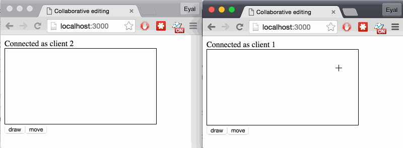
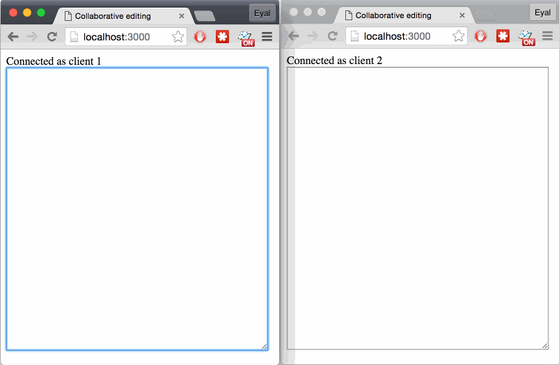

# olio

Synchronized collaborative state editing.  
Use as a client or as a server which syncs with multiple clients.

Clients generate sync requests and servers generate sync responses. A sync
request contains changes to state made by the client which the server should
apply. The response from the server contains changes made on the server since
the client's last sync.

Based on [Differential Synchronization by Neil Fraser](https://neil.fraser.name/writing/sync/eng047-fraser.pdf).




## API

### State

```Javascript
import State from 'olio';
var State = require('olio').State;
require(['olio/state'], function(State){ /* ... */ });
```

`State` is a constructor which receives an optional JSON object of the initial state.

`var s = new State()`  
`var s = new State(init)`

#### Modifying state

`s.set( keypath, value )`

0. `keypath {String/Array}`
0. `value {*}`

### Sync

```Javascript
import Sync from 'olio';
var Sync = require('olio').Sync;
require(['olio/sync'], function(Sync){ /* ... */ });
```

`Sync` is a constructor which receives a state.

`var sy = new State(state)`

### Adding a peer

`sy.addPeer(id);`

0. `id {String}`

### Sync cycles

A sync cycle can be initiated by any peer. Each cycle is made of:

0. A patch is generated by peer A (the initiating peer).
0. The patch is sent to peer B (over the network for example).
0. Peer B applies the patch and generates an answer patch.
0. The answer patch is sent to peer A.
0. Peer A applies the answer patch.

At the end of the cycle both peer have a consistent state; if further changes
were made, a new cycle needs to be executed.

#### Patch peer

`sy.patchPeer(id)`

0. `id {String}`

Generate a patch for the specified peer.

#### Receive a patch

`sy.receive(id, patch, preferRemote)`

0. `id {String}`
0. `Patch {Array}`
0. `preferRemote {Boolean}`

Receive a patch either as an answer or as a cycle request. If a cycle request
this method will return the answer to be sent to the other peer.
